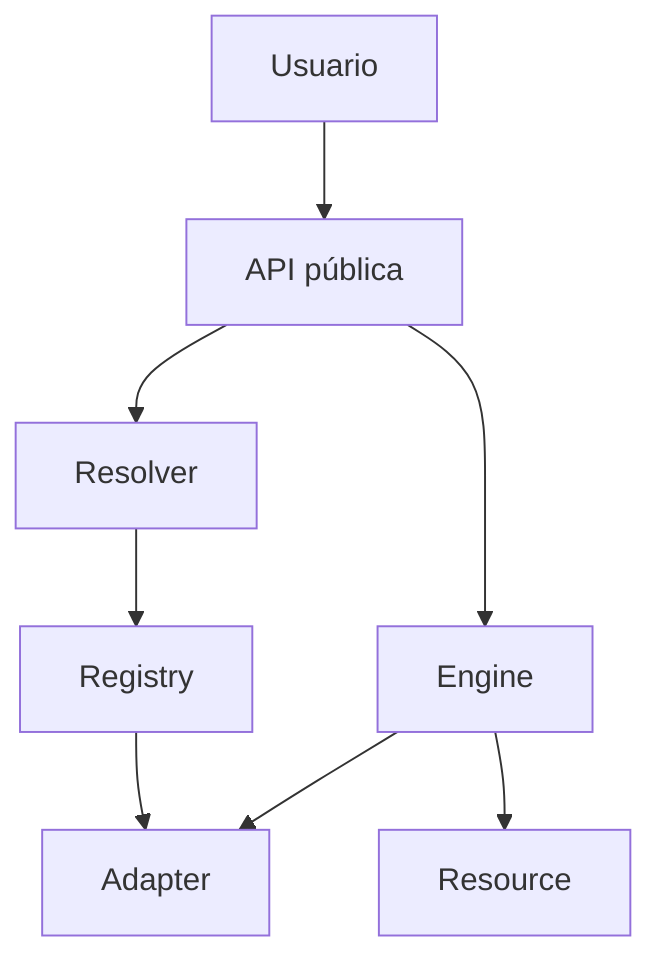

<div align="center">


# Iter

### Una API coherente para recursos, formatos, bibliotecas y backends.

[](https://github.com/Martinmanhue/Martinmanhue/stargazers)
[](ITER_PREVIEW.md)
[](#estado-actual)

**Meta del primer día: reunir a los primeros 10 desarrolladores que quieran seguir el lanzamiento.**

⭐ **Pulsa `Star` arriba a la derecha para apoyar Iter y seguir su evolución.**

[Ver la demostración](ITER_PREVIEW.md) · [Explorar la landing](https://github.com/Martinmanhue/Martinmanhue/tree/gh-pages) · [Leer el artículo técnico](DEV_ARTICLE.md)

</div>

---

## El problema

Abrir datos, convertir formatos, buscar recursos o cambiar de backend suele obligar a aprender una interfaz diferente para cada biblioteca.

Iter parte de una idea sencilla:

> **Aprende una vez. Usa cualquier biblioteca.**

No significa que todas las bibliotecas ya estén integradas. Significa que Iter está construyendo una capa común para expresar intenciones repetidas mediante una API coherente, manteniendo las diferencias importantes de cada backend.

## Iter en 30 segundos

```python
import iter

resource = iter.open("data.json")
converted = iter.convert(resource, "csv")
iter.export(converted, "data.csv")
```

La intención sigue siendo clara:

1. abrir un recurso;
2. convertirlo;
3. exportarlo.

Iter identifica el recurso, resuelve su formato, consulta los adaptadores compatibles y coordina la operación.

## Everything is a Resource

El modelo central representa archivos, datos y recursos web mediante objetos `Resource`.

```python
resource = iter.create(
    "data",
    name="project.json",
    data={
        "project": "Iter",
        "status": "release-candidate",
    },
    format="json",
)

iter.save(resource, destination="project.json")
reopened = iter.open("project.json")
```

## Lo que busca cambiar

| Hoy | Con Iter |
|---|---|
| Una interfaz distinta para cada herramienta | Una intención común y predecible |
| Código de integración repetido | Adaptadores reutilizables |
| Resolución manual de formatos y backends | Resolución coordinada por el motor |
| Cambiar de herramienta implica reescribir flujos | La API pública conserva la intención |

## Arquitectura



- `Resource`: representación universal de archivos, datos y recursos web.
- `Resolver`: identificación de formatos, tipos y backends.
- `Registry`: registro y selección de adaptadores.
- `Adapter`: ejecución de operaciones concretas.
- `Engine`: coordinación del sistema.

## Funciones previstas para la primera publicación

| Área | Operaciones |
|---|---|
| Entrada y salida | `open`, `create`, `save`, `close` |
| Resolución | `resolve` |
| Búsqueda | `find`, `search` |
| Transformación | `convert`, `export` |
| Internet | `download`, `upload` |
| Gestión | `copy`, `move`, `rename`, `delete` |
| Colecciones | `list`, `count`, `filter` |
| Adaptadores | `adapters`, `register_adapter`, `unregister_adapter` |
| Backend | `use`, `reset_backend`, `current_backend` |
| Diagnóstico | `statistics`, `about`, `iter doctor` |

## Estado actual

- **Versión candidata:** `0.3.0-rc.2`
- **Situación:** corrección de errores y validación privada.
- **Código principal:** privado mientras termina la auditoría de publicación.
- **PyPI:** todavía no existe un paquete oficial de Iter Project.
- **Demostración actual:** documentación, ejemplos y landing técnica sin instalación.

> No instales paquetes con nombres similares pensando que son oficiales. La primera distribución auténtica se anunciará desde este perfil.

## Qué puedes hacer hoy

1. ⭐ Pulsa **Star** para ser uno de los primeros seguidores.
2. Lee la [vista previa completa](ITER_PREVIEW.md).
3. Comparte qué formato, biblioteca o backend debería priorizar Iter.
4. Regresa durante el lanzamiento para probar la primera distribución oficial.

## Transparencia

Iter todavía no afirma compatibilidad universal ni integración con todas las bibliotecas. Solo se presentarán como disponibles las funciones implementadas y verificadas.

No se publica todavía:

- el código fuente privado completo;
- Iter Server;
- Iter Storage;
- credenciales, tokens o información personal;
- funciones sin pruebas verificables;
- ningún paquete demostrativo o instalación anticipada.

---

<div align="center">

### ¿Crees que las herramientas deberían compartir una API más coherente?

⭐ **Apoya Iter con una estrella y acompaña el lanzamiento.**

**Iter — Everything is a Resource.**

</div>
