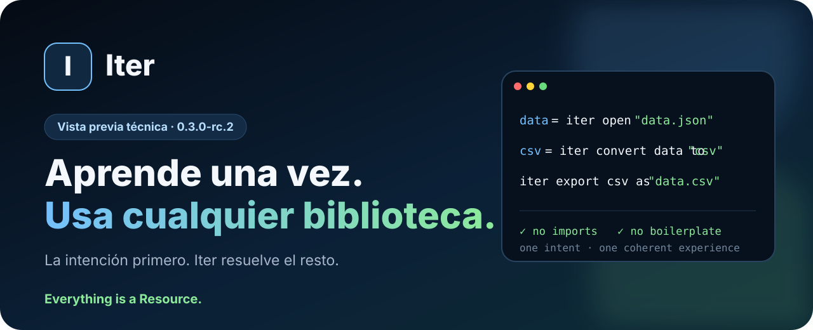
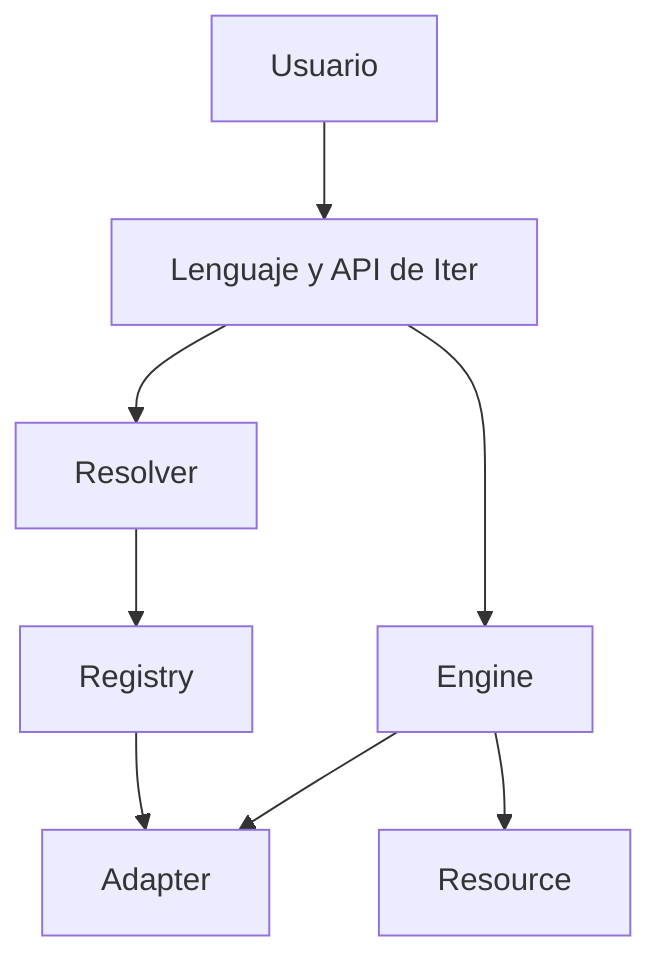

<div align="center">



# Iter

### Una experiencia común para recursos, formatos, bibliotecas y backends.

[](https://github.com/Martinmanhue/Martinmanhue/stargazers)
[](ITER_PREVIEW.md)
[](#estado-actual)

**Meta del primer día: reunir a los primeros 10 desarrolladores que quieran seguir el lanzamiento.**

⭐ **Pulsa `Star` arriba a la derecha para apoyar Iter y seguir su evolución.**

[Ver la demostración](ITER_PREVIEW.md) · [Proponer una prioridad](https://github.com/Martinmanhue/Martinmanhue/issues/1) · [Explorar la landing](https://github.com/Martinmanhue/Martinmanhue/tree/gh-pages) · [Compartir Iter](SHARE_ITER.md)

</div>

---

## El problema

Abrir datos, convertir formatos, buscar recursos o cambiar de backend suele obligar a aprender una interfaz diferente para cada biblioteca.

Iter parte de una idea sencilla:

> **Aprende una vez. Usa cualquier biblioteca.**

La experiencia de usuario no debería comenzar con imports, configuración auxiliar ni código que no forma parte de su intención.

## Iter en 10 segundos

```iter
data = iter open "data.json"
csv = iter convert data to "csv"
iter export csv as "data.csv"
```

Tres intenciones claras:

1. abrir;
2. convertir;
3. exportar.

Iter debe encargarse de identificar el recurso, resolver el formato, seleccionar un adaptador compatible y coordinar la operación.

## Crear un recurso sin código auxiliar

```iter
project = iter create "data" {
    project: "Iter"
    status: "release-candidate"
}

iter save project as "project.json"
reopened = iter open "project.json"
show reopened.data
```

## Usar una biblioteca

```iter
iter use "pandas"
data = iter open "sales.csv"
summary = iter analyze data
show summary
```

La idea no es ocultar todas las diferencias entre herramientas. Es permitir que el usuario exprese una intención común y que Iter resuelva cómo ejecutarla.

## Lo que busca cambiar

| Hoy | Con Iter |
|---|---|
| Imports y configuración antes de empezar | La intención aparece primero |
| Una interfaz distinta para cada herramienta | Una forma común de expresar operaciones |
| Código de integración repetido | Adaptadores reutilizables |
| Resolución manual de formatos y backends | Resolución coordinada por el motor |
| Cambiar de herramienta implica rehacer el flujo | El flujo conserva su significado |

## Arquitectura



- `Resource`: representación universal de archivos, datos y recursos web.
- `Resolver`: identificación de formatos, tipos y backends.
- `Registry`: registro y selección de adaptadores.
- `Adapter`: ejecución de operaciones concretas.
- `Engine`: coordinación del sistema.

## Operaciones previstas para la primera publicación

| Área | Operaciones |
|---|---|
| Entrada y salida | `open`, `create`, `save`, `close` |
| Resolución | `resolve` |
| Búsqueda | `find`, `search` |
| Transformación | `convert`, `export` |
| Internet | `download`, `upload` |
| Gestión | `copy`, `move`, `rename`, `delete` |
| Colecciones | `list`, `count`, `filter` |
| Backend | `use`, `reset`, `current` |
| Diagnóstico | `about`, `capabilities`, `adapters`, `doctor` |

## Estado actual

- **Versión candidata:** `0.3.0-rc.2`
- **Situación:** corrección de errores y validación privada.
- **Código principal:** privado mientras termina la auditoría de publicación.
- **PyPI:** todavía no existe un paquete oficial de Iter Project.
- **Demostración actual:** sintaxis, arquitectura y experiencia previstas, sin instalación.

> La sintaxis pública debe validarse antes del lanzamiento. No se anunciará como disponible ninguna instrucción que todavía no funcione de forma verificable.

## Participa antes del lanzamiento

### [¿Qué debería unificar Iter primero?](https://github.com/Martinmanhue/Martinmanhue/issues/1)

Puedes proponer un formato, una biblioteca, un backend o una operación que actualmente exija demasiado código de integración.

## Qué puedes hacer hoy

1. ⭐ Pulsa **Star** para ser uno de los primeros seguidores.
2. Lee la [vista previa completa](ITER_PREVIEW.md).
3. Responde a la [pregunta pública](https://github.com/Martinmanhue/Martinmanhue/issues/1).
4. Utiliza los [mensajes preparados para compartir Iter](SHARE_ITER.md).
5. Regresa durante el lanzamiento para probar la primera distribución oficial.

## Transparencia

Iter todavía no afirma compatibilidad universal ni que su sintaxis final sea inmutable.

No se publica todavía:

- el código fuente privado completo;
- Iter Server;
- Iter Storage;
- credenciales, tokens o información personal;
- funciones sin pruebas verificables;
- ningún paquete demostrativo o instalación anticipada.

---

<div align="center">

### ¿Crees que programar debería empezar por la intención y no por la configuración?

⭐ **Apoya Iter con una estrella y acompaña el lanzamiento.**

**Iter — Everything is a Resource.**

</div>
